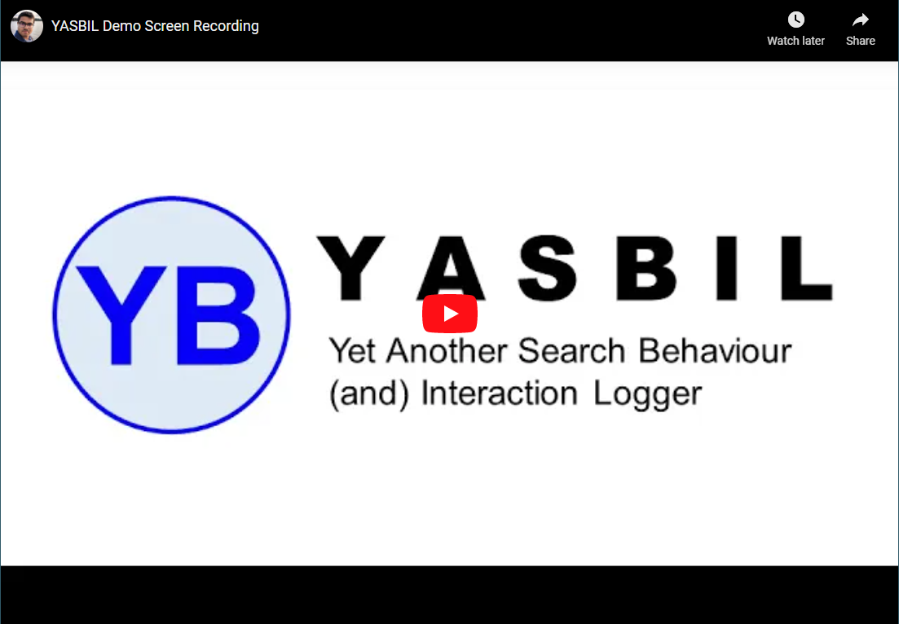

# YASBIL: Yet Another Search Behaviour (and) Interaction Logger
This repository contains the code for the paper [_YASBIL: Yet Another Search Behaviour (and) Interaction Logger_](https://doi.org/10.1145/3404835.3462800) accepted at SIGIR 2021 demo track.

YASBIL is a two-component logging solution for ethically recording a user's browsing activity for Interactive IR user studies. 
YASBIL comprises a Firefox browser extension and a WordPress plugin. The browser extension logs the browsing activity in the participants' machines. The WordPress plugin collects the logged data into the researcher's data server.
The logging works on any webpage, without the need to own or have knowledge about the HTML structure of the webpage. YASBIL also offers ethical data transparency and security towards participants, by enabling them to view and obtain copies of the logged data, as well as securely upload the data to the researcher's server over an HTTPS connection.


## Download Links:
- [Firefox Extension v2.1.0](https://github.com/yasbil/yasbil/raw/main/yasbil-extn-2.1.0.xpi) (for participants)
- [WordPress plugin v2.1.0](https://github.com/yasbil/yasbil/raw/main/yasbil-wp-2.1.0.zip) (for researchers) 
  - to be installed in central data repository

## Videos:

| SIGIR 2021 Presentation: Demo Track | How to Use YASBIL |
| ----------- | ----------- |
|[](https://www.youtube.com/watch?v=HDxPEFnvnm0 "SIGIR'21 presentation")|[](http://www.youtube.com/watch?v=-sxQ2Xh_EPo "YASBIL v1.0 - How to Use")|


## Instructions
- [Instructions for Participants](./docs/instructions-participant.md)
- [Instructions for Researchers](./docs/instructions-researcher.md)


## Data Dictionary
- [Click here to see the list of all database tables used by YASBIL](./docs/data-dictionary.md)


## Citation
If you use YASBIL in your research, please cite YASBIL as
```
@inproceedings{bhattacharya2021yasbil,
  title={YASBIL: Yet Another Search Behaviour (and) Interaction Logger},
  author={Bhattacharya, Nilavra and Gwizdka, Jacek},
  booktitle={Proceedings of the 44th International ACM SIGIR Conference on Research and Development in Information Retrieval},
  year={2021},
  doi={10.1145/3404835.3462800},
  series={SIGIR '21}
}
```

## Acknowledgement
We thank the authors and programmers of the CHI 2021 paper [_CoNotate: Suggesting Queries Based on Notes Promotes Knowledge Discovery_](https://dl.acm.org/doi/10.1145/3411764.3445618) for sharing their code as a [GitHub repository](https://github.com/creativecolab/CHI2021-CoNotate) and helping us to get ideas for implementing various parts of YASBIL.
