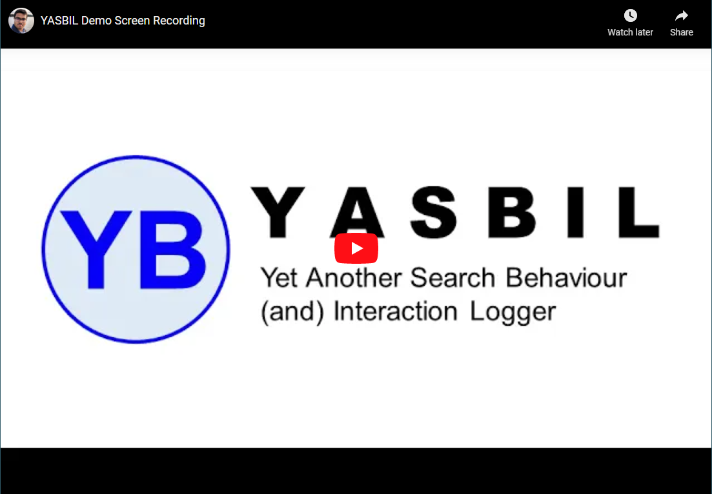

# YASBIL: Yet Another Search Behaviour (and) Interaction Logger

## Download Links:
* [YASBIL Browser Extension](https://github.com/yasbil/yasbil/raw/main/yasbil-extn-2.0.0.xpi) (for user) tested with Firefox
* [YASBIL WordPress plugin](https://github.com/yasbil/yasbil/raw/main/yasbil-wp.zip) (for researcher) to be installed in central data repository

## Demo Video:
Screen recording of a typical research participant’s search session and
interaction with YASBIL (both browser extension and WordPress plugin).

